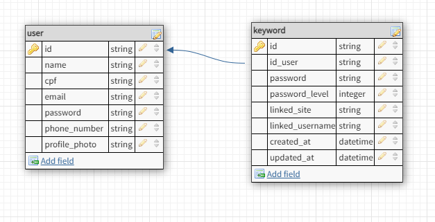

# PI-Password-Locker

## Envolvidos na Password-Locker
#### Turma D - TADS 3° Semestre 

- Tiago Fernandes<a href="https://www.linkedin.com/in/tiago-fernandes-ribeiro-03074815a/">💼Linkedin</a> <a href ="https://github.com/TiagoFernandes11">👩‍💻Github</a> 

- Kevin Pereira <a href="https://www.linkedin.com/in/kevin-alves-pereira/">💼Linkedin</a> <a href ="https://github.com/KevinAlvss">👩‍💻Github</a>

- Mariana Souza do Carmo <a href="https://www.linkedin.com/in/mariana-souza-240368224/">💼Linkedin</a> <a href ="https://github.com/maricsouza">👩‍💻Github</a>

- Nathalia da Rocha Santos<a href="">💼Linkedin</a> <a href ="https://github.com/NathaliadaRocha07">👩‍💻Github</a>

- Raian Medeiros Nolaço<a href="https://www.linkedin.com/in/raiannolaço/">💼Linkedin</a> <a href ="https://github.com/RaianNolaco?tab=repositories">👨‍💻Github</a>

- Vyviane Sousa Santos<a href="https://www.linkedin.com/in/vyvianesouza/">💼Linkedin</a> <a href ="https://github.com/Vyviane">👨‍💻Github</a>


## Links do projeto

- [Caso de uso (senac123)](https://whimsical.com/wolf-broker-X3JvkwLwjutfnSwNFmRTAv).
- [Protótipo Low/High Fidelity](https://www.figma.com/file/jegfVuFEJKQAzROxfipCPn/password-locker?node-id=54%3A2&t=JHLM2Gwa2P6bLFcQ-1).
- [MER](https://dbdesigner.page.link/MGXjLeVJCLgFKWcG9).
- [API (Backend)](https://github.com/TiagoFernandes11/PasswordLocker-Api).


## Funcionalidades
---
### Login
> Efetuar login em conta já existente
### Cadastro
> Criar uma conta em nossa corretora
### Cadastrar senhas
> Cadastrar senhas para poder consultar mais tarde
### Consultar senhas
> Consultar senhas já existentes
### Sugerir senhas fortes
> Gerar senhas fortes para o usuario
### Excluir contas
> Exclui a conta do cliente
---

## Casos de Uso


## MER


## Layout High-Fidelity

### Tela de cadastro


<!--- This is an HTML comment in Markdown 
  # (### Dashboard)
  # ()

  # (### Adicionar senha)
  # ()
--> 

### Tela de Login


### Tela da Home


### Tela de criação e geração de uma nova senha 


### Tela de alteração de senha


### Tela de Perfil


### Tela de Altera


### Tela de Normal Facebook


### Tela de Hover Senac


### Script do banco de dados 

```
DROP DATABASE PASSWORD_LOCKER;
CREATE DATABASE PASSWORD_LOCKER;
SHOW DATABASES;
USE PASSWORD_LOCKER;

CREATE TABLE TB_USER (
ID_USER      INT PRIMARY KEY AUTO_INCREMENT,
NOME         VARCHAR(50) NOT NULL,
CPF          VARCHAR(11) UNIQUE,
EMAIL				 VARCHAR(80) NOT NULL UNIQUE,
SENHA				 VARCHAR(100) NOT NULL,
TELEFONE     VARCHAR(14)
);

CREATE TABLE TB_SENHA (
ID_SENHA            INT PRIMARY KEY AUTO_INCREMENT,
TITULO		         VARCHAR(50) NOT NULL,
SENHA 				     VARCHAR(100) NOT NULL,
ID_USER            INT, 
FOREIGN KEY (ID_USER) REFERENCES TB_USER(ID_USER)
);

CREATE TABLE TB_WEBSITE ( 
ID_WEBSITE         INT PRIMARY KEY AUTO_INCREMENT,
URL             	 VARCHAR(500),
USUARIO 		       VARCHAR(100),
SENHA				       VARCHAR(100),
ID_USER                INT,
FOREIGN KEY (ID_USER) REFERENCES TB_USER(ID_USER)
);


-- TB_USER
INSERT INTO TB_USER (NOME, CPF, EMAIL, SENHA, TELEFONE) VALUES ('João Silva', '12345678901', 'joao.silva@gmail.com', 'senha123', '11999999999');
INSERT INTO TB_USER (NOME, CPF, EMAIL, SENHA, TELEFONE) VALUES ('Maria Souza', '23456789012', 'maria.souza@gmail.com', 'senha456', '11988888888');
INSERT INTO TB_USER (NOME, CPF, EMAIL, SENHA, TELEFONE) VALUES ('Pedro Santos', '34567890123', 'pedro.santos@gmail.com', 'senha789', '11977777777');
INSERT INTO TB_USER (NOME, CPF, EMAIL, SENHA, TELEFONE) VALUES ('Ana Oliveira', '45678901234', 'ana.oliveira@gmail.com', 'senha101112', '11966666666');
INSERT INTO TB_USER (NOME, CPF, EMAIL, SENHA, TELEFONE) VALUES ('Lucas Pereira', '56789012345', 'lucas.pereira@gmail.com', 'senha13141516', '11955555555');

-- TB_SENHA
INSERT INTO TB_SENHA (TITULO, SENHA, ID_USER) VALUES ('TITULO_1', 'senha1234', 1);
INSERT INTO TB_SENHA (TITULO, SENHA, ID_USER) VALUES ('TITULO_2', 'senha5678', 2);
INSERT INTO TB_SENHA (TITULO, SENHA, ID_USER) VALUES ('TITULO_3', 'senha91011', 3);
INSERT INTO TB_SENHA (TITULO, SENHA, ID_USER) VALUES ('TITULO_4', 'senha121314', 4);
INSERT INTO TB_SENHA (TITULO, SENHA, ID_USER) VALUES ('TITULO_5', 'senha15161718', 5);

-- TB_WEBSITE
INSERT INTO TB_WEBSITE (URL, USUARIO, SENHA,ID_USER) VALUES ('https://www.google.com/', 'joao.silva@gmail.com','google1234' ,1);
INSERT INTO TB_WEBSITE (URL, USUARIO, SENHA,ID_USER) VALUES ('https://www.facebook.com/', 'maria.souza@gmail.com','facebook5678' ,2);
INSERT INTO TB_WEBSITE (URL, USUARIO, SENHA,ID_USER) VALUES ('https://www.instagram.com/', 'pedro.santos@gmail.com','instagram91011' ,3);
INSERT INTO TB_WEBSITE (URL, USUARIO, SENHA,ID_USER) VALUES ('https://www.linkedin.com/','ana.oliveira@gmail.com', 'linkedin101112', 4);
INSERT INTO TB_WEBSITE (URL, USUARIO, SENHA,ID_USER) VALUES ('https://www.twitter.com/','lucas.pereira@gmail.com', 'twitter13141516', 5);

```


